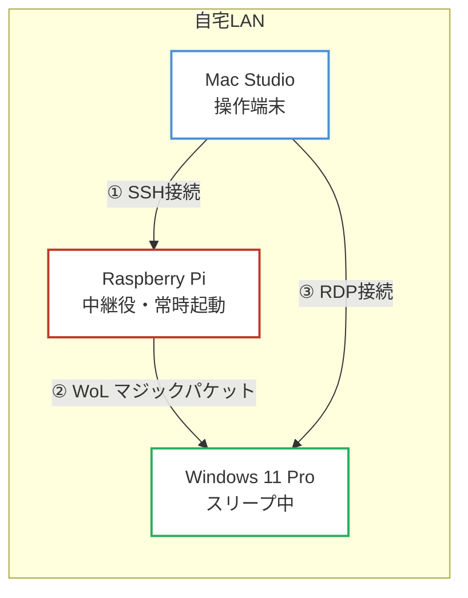
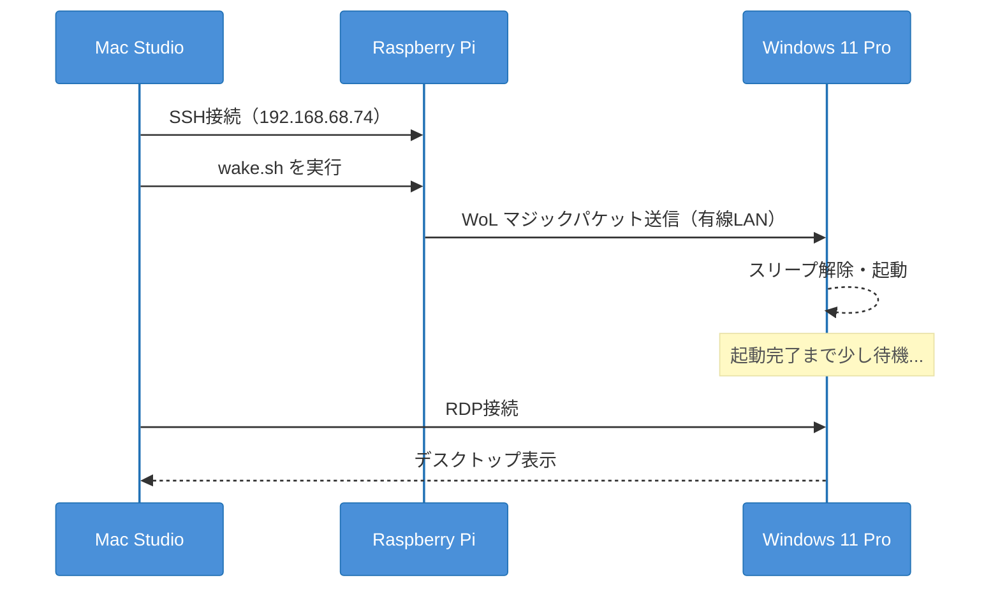
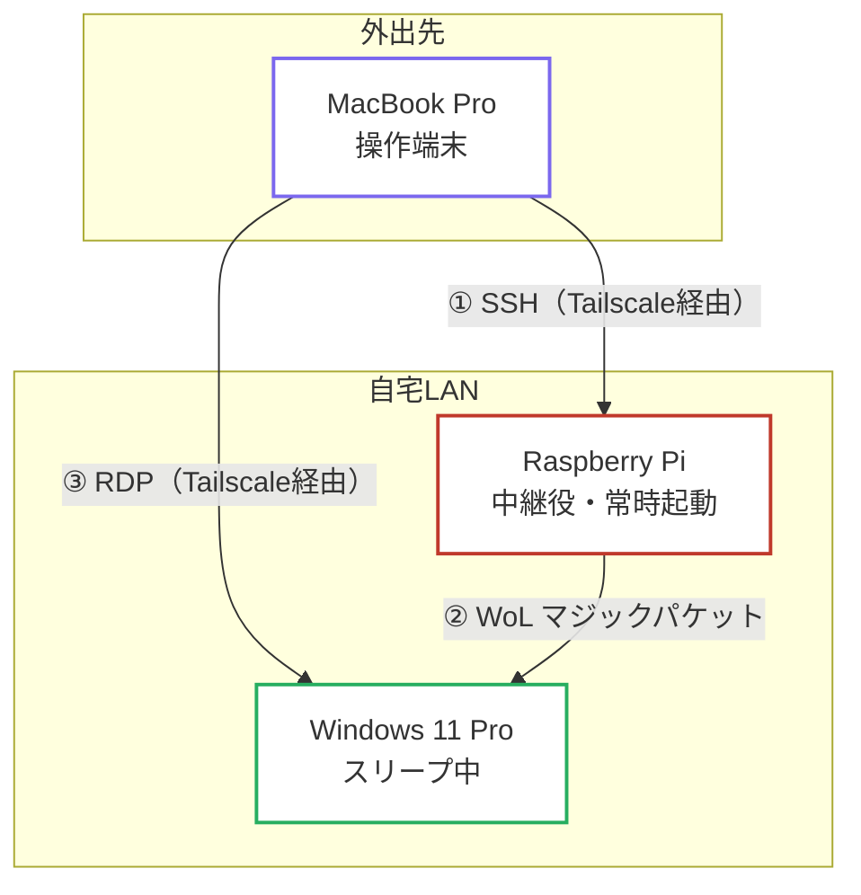
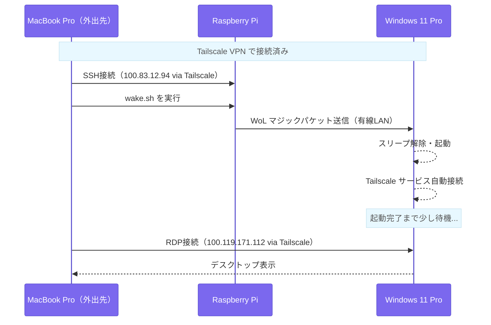

# Tailscale + WoL + RDP 記事素材メモ

> このファイルは記事執筆のための材料集め。現状の把握・構成整理・未確認事項の記録を目的とする。

---

## 記事の全体ゴール

外出先（MacBook Pro）から、スリープ中の自宅 Windows 11 Pro を起こして、リモートデスクトップで接続する。

---

## 構成図・フロー図

### フェーズ1：自宅LAN内の構成図



### フェーズ1：アクティビティ図



---

### フェーズ2：Tailscale経由の構成図



### フェーズ2：アクティビティ図



---

## 記事の構成（フェーズ分け）

### フェーズ1：自宅LAN内で Wake-on-LAN 環境を構築する

- Mac → Raspberry Pi（SSH）→ Windows（WoL）という流れを自宅LAN内で完成させる
- **動作確認済み**

### フェーズ2：Tailscale 経由で外出先から同じことをする

- SSH の接続先をローカルIPから Raspberry Pi の Tailscale IP に切り替える
- RDP の接続先を Windows の Tailscale IP に変える
- **未テスト**

---

## 登場人物

| デバイス | OS | 役割 | ローカルIP | Tailscale IP |
|----------|----|------|-----------|-------------|
| Mac Studio | macOS | 自宅の操作端末（普段使い） | - | `100.90.203.18` |
| MacBook Pro | macOS | 外出先の操作端末 | - | `100.115.14.1` |
| Windows 11 Pro | Windows 11 Pro | 自宅メインPC・接続先。有線LAN接続 | - | `100.119.171.112` |
| Raspberry Pi | Linux | 自宅内中継役・常時起動。ローカルIP固定 | `192.168.68.74` | `100.83.12.94` |

---

## フェーズ1：自宅LAN内の WoL 環境

### 構成図

```
Mac（自宅）
  └─[ssh wataru@192.168.68.74]─> Raspberry Pi
                                    └─[wakeonlan]─> Windows（スリープ解除）

Mac（自宅）
  └─[RDP]─> Windows
```

### 必要条件

#### ハードウェア

- Windows PC が **有線LAN接続**であること（無線LANではWoLは基本動作しない）
- 自宅ネットワークに**常時起動のデバイス**があること（今回は Raspberry Pi）

#### Windows の設定

- BIOS/UEFI で WoL が有効になっていること
- NIC（ネットワークカード）のドライバ設定で WoL が有効になっていること
- リモートデスクトップ（RDP）が有効になっていること

#### Raspberry Pi の設定

- `wakeonlan` コマンドがインストールされていること
  ```bash
  sudo apt install wakeonlan
  ```
- `wake.sh` が存在すること：
  ```bash
  # ~/wake.sh
  wakeonlan 9C:6B:00:79:C7:D9
  ```
  ※ `9C:6B:00:79:C7:D9` は Windows の有線NICのMACアドレス
- ローカルIPが固定されていること（`192.168.68.74`）
- SSH 接続を受け付けること

#### Mac の設定

- `~/.zshrc` に `wake` エイリアスが設定されていること：
  ```bash
  alias wake="ssh wataru@192.168.68.74 ./wake.sh"
  ```
- Microsoft Remote Desktop アプリがインストールされていること

### 動作手順（フェーズ1）

1. Mac で `wake` を実行
2. Raspberry Pi に SSH 接続され `wake.sh` が実行される
3. Raspberry Pi から Windows に WoL マジックパケット（UDP）が送信される
4. Windows がスリープから復帰する
5. Mac から RDP で Windows に接続する

### 確認状況

- [x] WoL 動作確認済み（Mac Studio から `wake` コマンドで Windows 起動）
- [x] RDP 接続確認済み（自宅LAN内）

---

## フェーズ2：Tailscale 経由で外出先から接続する

### 構成図

```
MacBook Pro（外出先）
  └─[Tailscale]─> Raspberry Pi（100.83.12.94）
                    └─[wakeonlan]─> Windows（スリープ解除）

MacBook Pro（外出先）
  └─[Tailscale]─> Windows（100.119.171.112）
                    └─[RDP]
```

### フェーズ1との違い

| 項目 | フェーズ1（自宅） | フェーズ2（外出先） |
|------|-----------------|------------------|
| Raspberry Pi への SSH | ローカルIP `192.168.68.74` | Tailscale IP `100.83.12.94` |
| Windows への RDP | ローカルIP | Tailscale IP `100.119.171.112` |
| wake エイリアス | 自宅用（有効） | 外出先用（要切り替え） |

### 追加で必要な条件

- Tailscale が全デバイスにインストール済みで、**同一アカウントでログイン・接続中**であること
- Windows の Tailscale が**スリープ復帰後に自動接続される**設定になっていること（重要）

### Mac の `.zshrc` 設定案

```bash
alias wake="ssh wataru@192.168.68.74 ./wake.sh"      # 自宅用（LAN内）
alias rwake="ssh wataru@100.83.12.94 ./wake.sh"      # 外出先用（Tailscale経由）
```

### 動作手順（フェーズ2）

1. MacBook Pro で Tailscale が接続中であることを確認
2. `rwake` を実行（Tailscale 経由で Raspberry Pi に SSH → WoL パケット送信）
3. Windows がスリープから復帰し、Tailscale に自動接続される
4. MacBook Pro から Windows の Tailscale IP（`100.119.171.112`）に RDP 接続

### 確認状況

- [x] Raspberry Pi の Tailscale 接続：復帰済み（`sudo tailscale up --accept-routes --advertise-exit-node` で再ログイン）
- [ ] MacBook Pro の Tailscale 接続状態（外出時に確認）
- [ ] 外出先から `ssh wataru@100.83.12.94 ./wake.sh` で WoL が届くか
- [x] WoL 後、Windows が Tailscale に自動接続されるか（Tailscaleサービスが「自動・実行中」であることを確認済み。ユーザーログイン不要で接続される）
- [ ] Windows の Tailscale IP（`100.119.171.112`）に RDP 接続できるか

---

## Tailscale ネットワーク全体

```
# tailscale status（Windows で取得）
100.119.171.112  windows11      0ceanmoo@  windows  接続中
100.90.203.18    mac-studio     0ceanmoo@  macOS    接続中
100.83.12.94     raspberrypi    0ceanmoo@  linux    接続中（exit node）← 復帰済み
100.115.14.1     macbook-pro    0ceanmoo@  macOS    offline（外出時に接続）
100.83.250.29    118-27-1-226   0ceanmoo@  linux    idle（用途不明）
100.77.129.127   iphone-15      0ceanmoo@  iOS      offline
```

---

## メモ・気づき

- Raspberry Pi のローカルIPは固定（`192.168.68.74`）。ルーター側のDHCP固定か Pi 側の static IP 設定のどちらか。
- Windows の Tailscale 自動起動設定が重要。スリープ復帰後に Tailscale が接続されないと RDP 接続できない。
- Raspberry Pi の Tailscale が再ログインを要求するケースがある（今回は68日間オフラインで logout 状態に）。定期的な確認が必要。
- IP forwarding（`/etc/sysctl.d/99-tailscale.conf`）は exit node 機能のために必要だが、今回のゴール（WoL + RDP）には不要。
